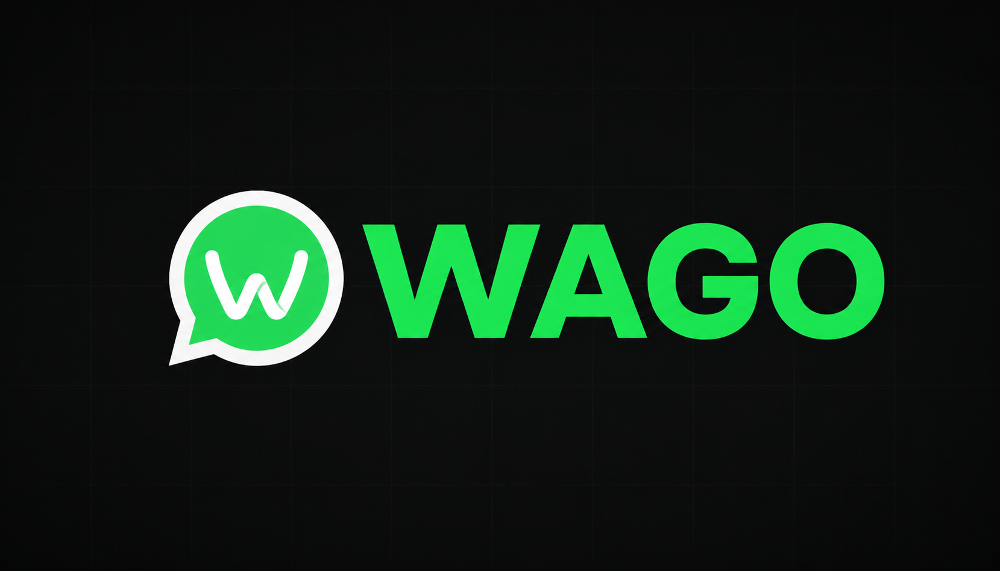

# Wago — WhatsApp Webhooks, Instant Setup

<p align="center">
  
</p>

<p align="center">
  <strong>Connect WhatsApp numbers, receive real-time webhooks, and send messages — all through a simple API.</strong><br>
  No infrastructure to manage. Fully open source.
</p>

<p align="center">
  <a href="https://wago.com"></a>
  <a href="https://www.npmjs.com/package/@wago/sdk"></a>
  <a href="https://pypi.org/project/wago/"></a>
  <a href="https://discord.gg/B2XNf97Vby"></a>
  <a href="https://x.com/juah3h32"></a>
</p>

<p align="center">
  <a href="LICENSE"></a>
  <a href="https://github.com/juah3h32/wago/actions"></a>
  <a href="https://deepwiki.com/juah3h32/wago"></a>
</p>

<p align="center">
  <a href="https://wago.com/docs">Documentation</a> &middot;
  <a href="https://wago.com/signup">Get Started</a> &middot;
  <a href="https://discord.gg/B2XNf97Vby">Discord</a> &middot;
  <a href="https://x.com/juah3h32">Twitter</a>
</p>

---

## Why Wago?

Building WhatsApp integrations shouldn't require managing WAHA containers, configuring Kubernetes, or wiring up webhook delivery pipelines. Wago handles all of that so you can focus on your application.

- **Zero infrastructure** — we run the WhatsApp sessions, you receive the webhooks
- **Simple API** — REST API, TypeScript SDK, Python SDK, CLI, and MCP server
- **$0.99/month per connection** — no minimums, no hidden fees
- **Open source** — MIT licensed, self-host if you prefer

## Quick Start

### Install the CLI

```bash
curl -fsSL wago.com/install | bash
```

Or via npm:

```bash
npm install -g wago
```

### Connect WhatsApp in 30 seconds

```bash
wago login
wago connections create
wago connections qr <id> --poll   # Scan with WhatsApp
```

<p align="center">
  
</p>

### Receive webhooks

```bash
wago webhooks create <connection-id> --url https://your-app.com/webhook
```

Every WhatsApp message, status change, and event is delivered to your endpoint with HMAC-SHA256 signatures and automatic retries.

### Send messages

```bash
wago send <connection-id> --to 1234567890@s.whatsapp.net --text "Hello from Wago"
```

## SDKs

### TypeScript

```bash
npm install @wago/sdk
```

```typescript
import { Wago } from '@wago/sdk';

const client = new Wago({ apiKey: 'wh_...' });
const connections = await client.connections.list();
await client.messages.send(connectionId, {
  chatId: '1234567890@s.whatsapp.net',
  text: 'Hello!',
});
```

### Python

```bash
pip install wago
```

```python
from wago import Wago

client = Wago(api_key="wh_...")
connections = client.connections.list()
client.messages.send(connection_id, chat_id="1234567890@s.whatsapp.net", text="Hello!")
```

### MCP Server

Connect Wago to Claude, Cursor, Windsurf, and other AI assistants:

```json
{
  "mcpServers": {
    "wago": {
      "type": "http",
      "url": "https://api.wago.com/mcp"
    }
  }
}
```

## Features

- **Managed WhatsApp Sessions** — Cloud-hosted WAHA containers with automatic scaling and health monitoring
- **Persistent Sessions** — Auth state persisted in Postgres, survives restarts and node replacements
- **Webhook Delivery** — HMAC-SHA256 signed payloads, 5 retries with exponential backoff, dead-letter queue
- **Real-time Events** — Messages, status changes, presence updates, delivered via BullMQ
- **SDKs & CLI** — TypeScript and Python SDKs, Go CLI, MCP server for AI assistants
- **Chat Viewer** — Built-in dashboard to view chats, send messages, and manage connections
- **OAuth & API Tokens** — Supabase Auth with JWT, API tokens with `wh_` prefix for programmatic access
- **Auto-scaling** — Kubernetes-based scaling with proactive provisioning (buffer at 10 remaining slots)
- **Open Source** — MIT licensed, self-hostable, fully documented

## Architecture

```
Browser ──► Next.js Dashboard (Vercel)
                │
                ▼
            NestJS API ◄──── Stripe (billing webhooks)
            │       │
     ┌──────┘       └──────┐
     ▼                      ▼
  Supabase               k3s Cluster (Hetzner Cloud)
  (Postgres + Auth)      ├── WAHA StatefulSet (autoscaled 1–10 nodes)
                         ├── Redis (BullMQ + AOF persistence)
                         └── Cluster Autoscaler
                                │
                                ▼
                         Customer Webhook
                         Endpoints (HMAC-signed)
```

| Component | Tech | Hosting |
|-----------|------|---------|
| Dashboard | Next.js 15, React 19, Tailwind CSS 4 | Vercel |
| API | NestJS 11, TypeScript | k3s on Hetzner Cloud |
| WhatsApp Engine | WAHA Plus (NOWEB, ~50 sessions/pod) | k3s StatefulSet |
| Database + Auth | Supabase (Postgres + Auth + JWTs) | Supabase Cloud |
| Message Queue | BullMQ + Redis 7 (AOF persistence) | k3s Deployment |
| Billing | Stripe prepaid slots ($0.99/connection/month) | Stripe |
| Infrastructure | Terraform + kube-hetzner | Hetzner Cloud |
| Monorepo | Turborepo + pnpm workspaces | — |

## API Reference

All routes prefixed with `/api`. Auth via Supabase JWT or API token in `Authorization: Bearer` header.

### Connections

| Method | Route | Description |
|--------|-------|-------------|
| `GET` | `/api/connections` | List connections |
| `POST` | `/api/connections` | Create connection |
| `GET` | `/api/connections/:id` | Get connection detail |
| `GET` | `/api/connections/:id/qr` | Get QR code |
| `GET` | `/api/connections/:id/chats` | Get recent chats |
| `GET` | `/api/connections/:id/me` | Get WhatsApp profile |
| `POST` | `/api/connections/:id/restart` | Restart session |
| `DELETE` | `/api/connections/:id` | Delete connection |

### Webhooks

| Method | Route | Description |
|--------|-------|-------------|
| `GET` | `/api/connections/:cid/webhooks` | List webhook configs |
| `POST` | `/api/connections/:cid/webhooks` | Create webhook |
| `PUT` | `/api/webhooks/:id` | Update webhook |
| `DELETE` | `/api/webhooks/:id` | Delete webhook |
| `GET` | `/api/webhooks/:id/logs` | Delivery logs |

### Billing

| Method | Route | Description |
|--------|-------|-------------|
| `GET` | `/api/billing/status` | Subscription status |
| `POST` | `/api/billing/checkout` | Create checkout session |
| `POST` | `/api/billing/portal` | Stripe customer portal |

Full API documentation: [wago.com/docs](https://wago.com/docs)

## Self-Hosting

### Prerequisites

- Node.js 20+, [pnpm](https://pnpm.io/) 9+
- [Supabase](https://supabase.com/) project (Postgres + Auth)
- Docker (for local WAHA)

### Local Development

```bash
git clone https://github.com/juah3h32/wago.git
cd wago

pnpm install

cp apps/api/.env.example apps/api/.env
cp apps/web/.env.example apps/web/.env
# Fill in your Supabase + Stripe credentials

pnpm db:push    # Push schema to DB
pnpm dev        # Start API (:3001) + Web (:3000)
```

### Production Deployment

Infrastructure is fully declarative via Terraform using [kube-hetzner](https://github.com/kube-hetzner/terraform-hcloud-kube-hetzner):

```bash
cd terraform/
cp terraform.tfvars.example terraform.tfvars
terraform init && terraform apply
```

This provisions:
- k3s control plane on Hetzner Cloud
- Autoscaling 1–10 worker nodes for WAHA pods
- Redis, RBAC, secrets, and all k8s resources

CI/CD via GitHub Actions: build Docker image → run migrations → rolling deploy.

See [k8s/README.md](k8s/README.md) for full deployment docs.

## Project Structure

```
wago/
├── apps/
│   ├── api/              NestJS API server
│   └── web/              Next.js dashboard + docs (Fumadocs)
├── packages/
│   ├── db/               Drizzle ORM schema + migrations
│   ├── shared-types/     TypeScript domain types
│   └── config/           Shared ESLint + TypeScript configs
├── sdks/
│   ├── python/           Python SDK (PyPI: wago)
│   ├── typescript/       TypeScript SDK (npm: wago)
│   └── mcp/              MCP server (OAuth via Supabase)
├── cli/                  Go CLI (Cobra)
├── terraform/            k3s cluster provisioning
└── k8s/                  Kubernetes manifests
```

## Contributing

Contributions welcome! See the [docs](https://wago.com/docs) for architecture details.

1. Fork the repo
2. Create a branch (`git checkout -b feat/my-feature`)
3. Commit with conventional commits (`feat:`, `fix:`, etc.)
4. Open a PR

Join our [Discord](https://discord.gg/B2XNf97Vby) to discuss ideas and get help.

## License

[MIT](LICENSE)

---
